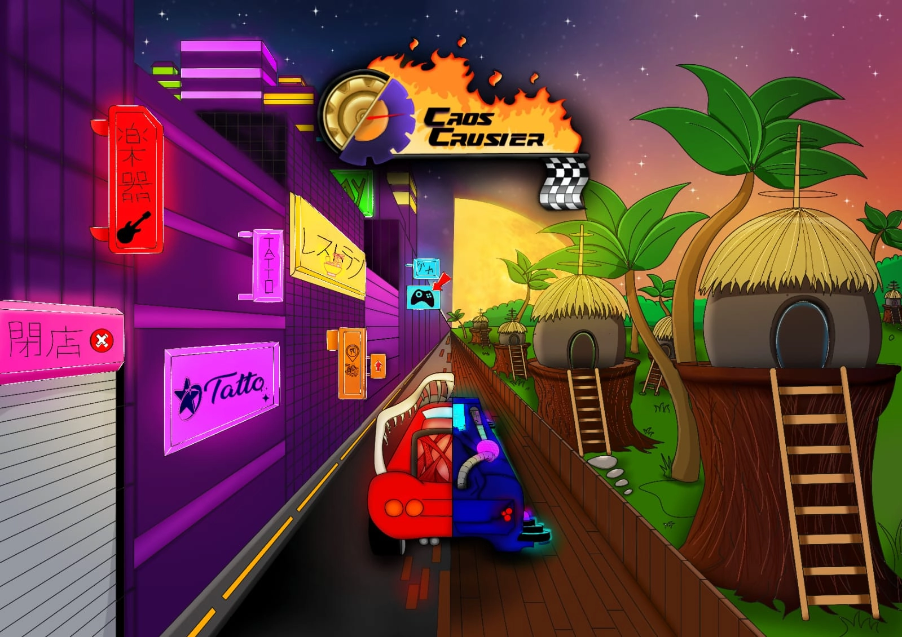

# Yosagi Games - Site da Empresa

> Este é um site para introduzir consumidores à nossa empresa.

## 💻 Pré-requisitos

Antes de começar, verifique se você atendeu aos seguintes requisitos:

- Você tem uma máquina `Windows / Linux / Mac`.
- Você leu LINK DA WIKI.

## 📫 Contribuindo para a empresa

Para contribuir com nossa empresa, você pode visitar nossas redes sociais para ajudar na divulgação de nosso trabalho.
- [Instagram](https://www.instagram.com/yosagi.games/)
- [GitHub](https://github.com/YosagiGames)

## 🤝 Colaboradores

Agradecemos às seguintes pessoas que contribuíram para este projeto:

| [ Felipe Custódio](https://github.com/FilipeCGEtec) | [ Gabriele Batista](https://github.com/Gabriele-sousa) | [ Letícia Lapa](https://github.com/LehLapa) |
| :---: | :---: | :---: 

| [ Mariana Santiago](https://github.com/MariSantiago0) | [ Robert Caio](https://github.com/Rob3rt2) | [ Yuri Telis](https://github.com/yuritelis) |
| :---: | :---: | :---: 
